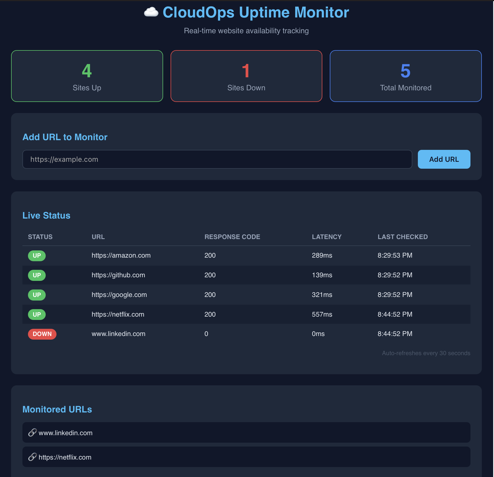
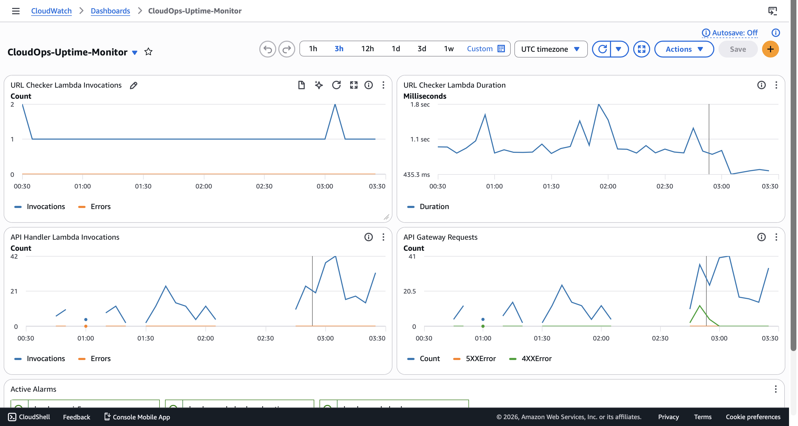
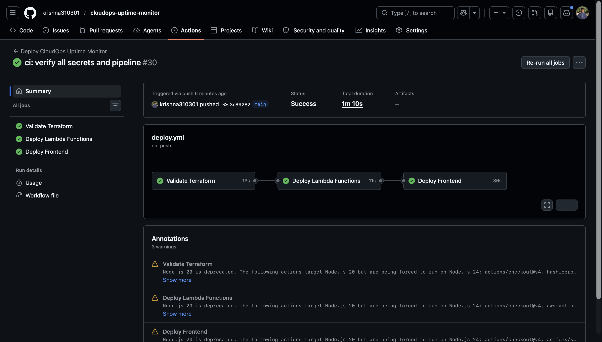
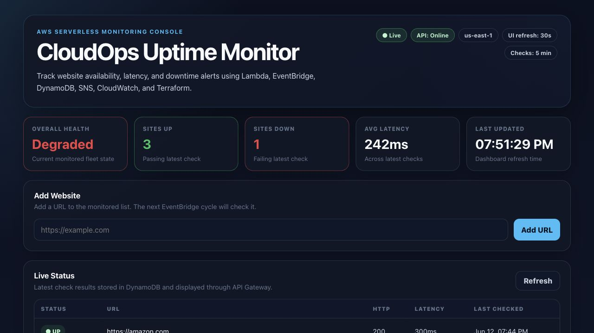
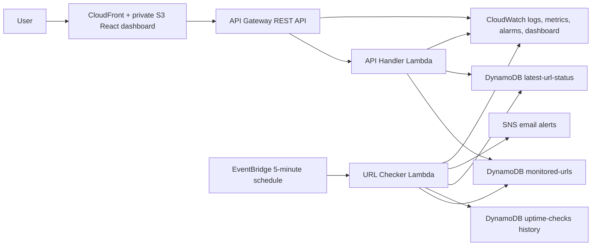

# CloudOps Uptime Monitor

[](https://github.com/krishna310301/cloudops-uptime-monitor/actions/workflows/deploy.yml)

CloudOps Uptime Monitor is a serverless website uptime monitoring system built on AWS. It checks website availability every 5 minutes, stores recent status history, maintains an efficient latest-status view, sends alerts on downtime, publishes custom CloudWatch metrics, and displays live status through a React dashboard served by CloudFront.

I built this after working in operations environments where a simple question like "is the service actually reachable?" needed a fast, trustworthy answer. This project keeps that workflow small and practical: scheduled checks, recent history, alerting, and a dashboard that makes the current state easy to scan.

**Live Dashboard:** https://d3hlcf532b9plq.cloudfront.net

From the dashboard, I can:

- Add URLs to monitor
- View latest uptime status for all monitored sites
- Track response latency and HTTP status codes per site
- Receive SNS email alerts when a monitored site goes down
- Watch the view refresh automatically every 30 seconds

---

## Engineering Outcomes

| Improvement | Result |
| --- | --- |
| Current-status lookup | Reduced candidate records from 86,400 historical rows to 10 latest-status rows for a 10-URL, 30-day reference workload |
| Custom observability | Added 9 application-level CloudWatch metrics in `CloudOps/UptimeMonitor` |
| API abuse controls | Added API key enforcement, 10 req/sec throttling, 20-request burst limit, and 10,000 request/day quota |
| CORS posture | Changed from wildcard browser access to configured allowed origins, defaulting to the CloudFront dashboard |
| Alert behavior | Added state-change alerting so sustained outages do not send repeated SNS emails, while recovery events still notify |
| URL safety | Blocks localhost, private IP ranges, loopback, link-local, reserved targets, AWS metadata IP, and unsafe redirects |
| Failure drill | Captured live outage/recovery drill with 1-second detection, 26-second dashboard DOWN visibility, and zero duplicate DOWN alerts |
| Validation | Added backend, frontend, Terraform, and security checks for Lambda handlers, dashboard states, IaC validation, and code scanning |

See [docs/metrics.md](docs/metrics.md) for formulas and [docs/failure-drill.md](docs/failure-drill.md) for the completed outage drill.

---

## Screenshots

### Live Dashboard


### CloudWatch Monitoring


### CI/CD Pipeline


### Failure Drill


---

## Architecture



---

## Features

- **Automated monitoring** — EventBridge triggers URL checks every 5 minutes
- **Real-time dashboard** — React frontend showing live status, latency, response codes
- **Instant alerts** — SNS email notifications when a site goes down
- **Alert deduplication** — sends downtime alerts on `UP -> DOWN`, suppresses repeated `DOWN -> DOWN`, and sends recovery alerts on `DOWN -> UP`
- **Historical data** — Check results stored in DynamoDB with TTL-based retention
- **Efficient latest status** — dashboard reads the `latest-url-status` table instead of scanning retained history
- **Add/remove URLs** — API endpoints to manage monitored websites
- **URL safety checks** — blocks localhost, private IP ranges, AWS metadata IP, unsafe schemes, and unsafe redirects
- **CloudWatch visibility** — dashboard tracking Lambda metrics, custom uptime metrics, lookup efficiency, errors, and duration
- **API hardening** — API key requirement, usage plan throttling, daily quota, and restricted CORS
- **Operational safeguards** — encrypted logs and data stores, Lambda DLQs, X-Ray tracing, API access logs, and CloudFront security headers
- **Infrastructure as Code** — stack provisioned with Terraform
- **CI/CD pipeline** — GitHub Actions runs Lambda tests, frontend tests/build, Terraform validation, security scans, and manual AWS deployment

---

## Tech Stack

| Layer          | Technology                                  |
| -------------- | ------------------------------------------- |
| Frontend       | React, private S3 origin, CloudFront        |
| API            | API Gateway, Lambda (Python)                |
| Scheduler      | EventBridge                                 |
| Database       | DynamoDB with TTL and latest-status access pattern |
| Alerts         | SNS                                         |
| Monitoring     | CloudWatch Logs, Metrics, Alarms, Dashboard |
| Infrastructure | Terraform                                   |
| CI/CD          | GitHub Actions                              |

---

## Operational Readiness

- 19 Lambda unit tests cover URL normalization, unsafe target rejection, state-change alerting, recovery notifications, API behavior, metric publishing, TTL writes, and latest-status updates.
- 5 React dashboard tests cover loading, empty, success, failure, API key headers, and unsafe URL rejection.
- Terraform validation checks formatting and provider configuration before deployment.
- Bandit scans Lambda handlers for Python security issues.
- Checkov scans Terraform with documented tradeoffs for the low-cost public monitor architecture.
- Manual AWS deployment uses GitHub Actions OIDC instead of long-lived cloud credentials.

---

## AWS Services Used

- **Lambda** — serverless URL checker and API handler
- **DynamoDB** — stores monitored URLs, retained uptime check history, and latest URL status
- **EventBridge** — scheduled rule triggering checks every 5 minutes
- **API Gateway** — REST API for dashboard communication
- **SNS** — email alerts on downtime detection
- **S3** — private origin bucket for the React frontend build
- **CloudFront** — CDN serving the frontend globally over HTTPS using Origin Access Control
- **CloudWatch** — logs, metrics, alarms, and dashboard for full observability
- **IAM** — least-privilege roles for all Lambda functions
- **Terraform** — provisions and manages all infrastructure as code

---

## Project Structure

```
cloudops-uptime-monitor/
├── lambda/
│   ├── url_checker.py      # checks URLs, saves results, sends alerts
│   └── api_handler.py      # handles API Gateway requests
├── frontend/
│   └── src/
│       └── App.js          # React dashboard
├── terraform/
│   ├── main.tf             # all AWS resources
│   ├── variables.tf        # configurable variables
│   └── outputs.tf          # output values
├── tests/                  # Lambda handler unit tests
├── docs/
│   ├── metrics.md          # measured improvements and formulas
│   ├── failure-drill.md    # downtime drill evidence template
│   ├── runbook.md          # operational troubleshooting
│   ├── security.md         # controls and tradeoffs
│   ├── design-tradeoffs.md # architecture decisions
│   └── cost.md             # workload cost model
└── .github/
    └── workflows/
        └── deploy.yml      # CI/CD pipeline
```

---

## API Endpoints

| Method | Endpoint    | Description                            |
| ------ | ----------- | -------------------------------------- |
| GET    | /status     | Get latest uptime results for all URLs |
| GET    | /urls       | List all monitored URLs                |
| POST   | /urls       | Add a new URL to monitor               |
| DELETE | /urls       | Remove a URL from monitoring using JSON body |
| DELETE | /urls/{url} | Remove a URL from monitoring using encoded path |

---

## CI/CD Pipeline

Every push and pull request validates the project. AWS deployment is manual-only through `workflow_dispatch` with `deploy_to_aws = true`.

1. **Runs Lambda unit tests** — validates URL normalization, input validation, and TTL writes
2. **Scans Lambda code** — runs Bandit against Python Lambda handlers
3. **Runs frontend tests/build** — validates dashboard API states and API key headers
4. **Validates Terraform** — runs `terraform validate` and `terraform fmt -check`
5. **Scans Terraform security** — runs Checkov in advisory mode for IaC findings
6. **Deploys manually** — zips Lambda functions, builds the frontend, syncs to S3, invalidates CloudFront cache

Manual deployment uses GitHub Actions OIDC with `AWS_ROLE_TO_ASSUME`, avoiding long-lived AWS access keys in repository secrets.

---

## CloudWatch Monitoring

Four alarms configured:

- `cloudops-url-checker-errors` — fires when Lambda errors ≥ 1
- `cloudops-url-checker-duration` — fires when avg duration ≥ 25 seconds
- `cloudops-api-handler-errors` — fires when the API handler Lambda errors ≥ 1
- `cloudops-urls-down` — fires when the custom `URLsDown` metric is ≥ 1

All alarms publish to SNS for email notification.

Dashboard: **CloudOps-Uptime-Monitor** in AWS CloudWatch console.

Custom metrics published in `CloudOps/UptimeMonitor`:

- `URLsChecked`
- `URLsDown`
- `URLCheckLatencyMs`
- `CheckRunDurationMs`
- `AlertsSent`
- `MonitoredURLCount`
- `StatusLookupRecordsRead`
- `URLAdded`
- `URLDeleted`

---

## AWS Infrastructure

Terraform provisions:

- 3 DynamoDB tables
- 2 Lambda functions
- 2 SQS dead-letter queues
- 1 customer-managed KMS key
- 1 IAM role with least-privilege policies
- 1 EventBridge rule + target
- 1 API Gateway REST API with Lambda proxy integration, API key, usage plan, access logs, throttling, quota, and prod stage
- 1 SNS topic + email subscription
- 1 private, encrypted, versioned S3 bucket for frontend assets
- 1 CloudFront distribution with Origin Access Control and managed security headers
- 4 CloudWatch alarms
- 1 CloudWatch dashboard

---

## Quick Start

```bash
git clone https://github.com/krishna310301/cloudops-uptime-monitor.git
cd cloudops-uptime-monitor/terraform
cp terraform.tfvars.example terraform.tfvars
# Edit terraform.tfvars with your email and bucket name
terraform init
terraform plan
terraform apply
```

After deployment:
1. Confirm the SNS email subscription from your inbox
2. Set `REACT_APP_API_BASE_URL` to the Terraform `api_url` output before building the frontend
3. Set `REACT_APP_API_KEY` to the sensitive Terraform `dashboard_api_key_value` output before building the frontend
4. Open the CloudFront URL from Terraform outputs
5. Add a URL from the dashboard
6. Wait for the next EventBridge check cycle (every 5 minutes)

## Local Validation

```bash
PYTHONPATH=. python -m unittest discover -s tests -v
cd frontend && npm ci && npm test -- --watchAll=false && npm run build
cd ../terraform && terraform init -backend=false && terraform fmt -check && terraform validate
```

## Cleanup

```bash
cd terraform
terraform destroy
```

---
